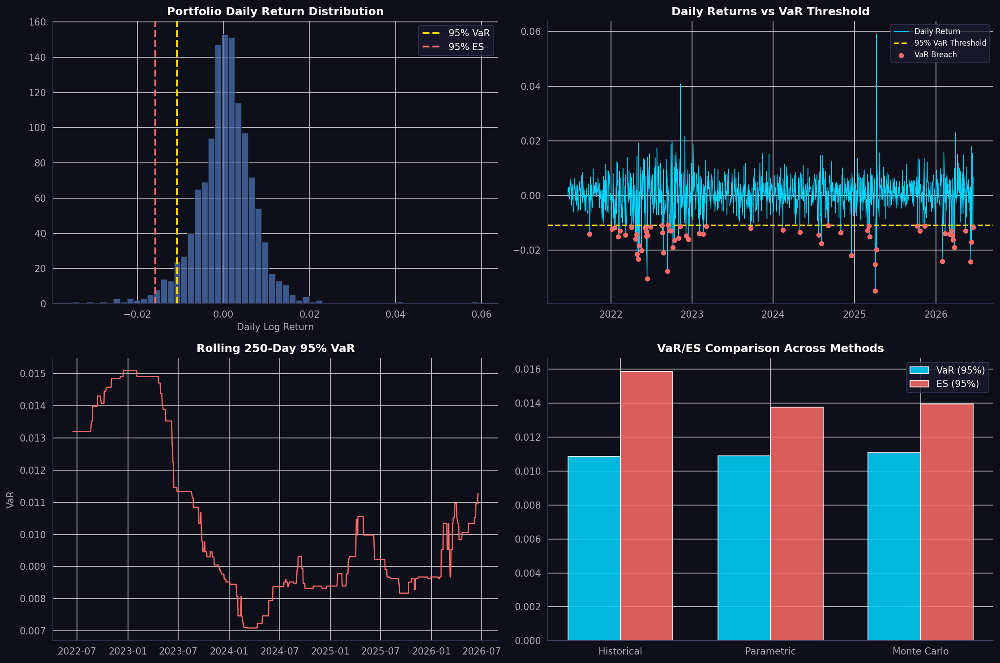

# Value-at-Risk & Expected Shortfall Engine

## Project Overview

A multi-method portfolio risk engine that computes Value-at-Risk (VaR) and Expected Shortfall (ES/CVaR) using three industry-standard methodologies — Historical Simulation, Parametric (Variance-Covariance), and Monte Carlo simulation — then validates the model via statistical backtesting. The output is formatted as a daily risk report, mirroring what a bank market risk desk produces every morning.

## Real-World Use Case

VaR and Expected Shortfall sit at the centre of regulatory capital requirements under Basel III, daily risk limit monitoring at banks and asset managers, and internal risk budgeting at hedge funds. This project replicates the full cycle used by bank market risk desks: measure risk → validate the measurement → report it.

## Methods Implemented

- **Historical Simulation** — uses real historical returns with no distributional assumption; captures real fat tails and market crashes
- **Parametric (Variance-Covariance)** — assumes normally distributed returns; fast and analytically clean but understates tail risk
- **Monte Carlo Simulation** — simulates 10,000 random return scenarios; most flexible and extensible method
- **Kupiec Backtesting** — statistical test checking whether VaR breach frequency matches the stated confidence level, consistent with Basel III internal model validation requirements

## Key Features

- Multi-asset portfolio (SPY, AGG, GLD, QQQ) with configurable weights
- VaR and ES computed at both 95% and 99% confidence levels
- All three methods compared side by side
- Kupiec POF test for model validation
- Professional risk dashboard with 4 charts

## Technologies Used

- **Python** — pandas, numpy, scipy, matplotlib, seaborn
- **Yahoo Finance** — 5 years of daily price data

## How to Run

1. Open `VaR_ES_Engine.ipynb` in Google Colab
2. Run all cells sequentially from top to bottom
3. Data is pulled live from Yahoo Finance — no manual downloads needed
4. Risk dashboard and summary report are saved automatically

## Resume Description

*"Built a multi-method Value-at-Risk and Expected Shortfall engine in Python, implementing Historical Simulation, Parametric, and Monte Carlo approaches across a diversified multi-asset portfolio; validated model accuracy via Kupiec backtesting in line with Basel III regulatory standards."*

## Potential Upgrades

- Replace static
